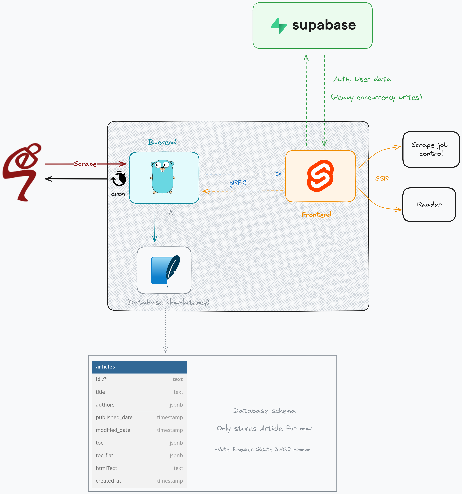

# RE:SEP
An alternative article reader for the [Stanford Encyclopedia of Philosophy](https://plato.stanford.edu).
Built with Go + gRPC + Sveltekit

### Architecture (drafted)

### :warning: Status: Portfolio :warning:
This project is in **Portfolio Status**, meaning that there hasn't been any actual work done to it
and currently it only serves as something to be put on resume (ideally with some ChatGPT generated
description). The project tech stack is also subjected to changes and this repo can be nuked at anytime.
