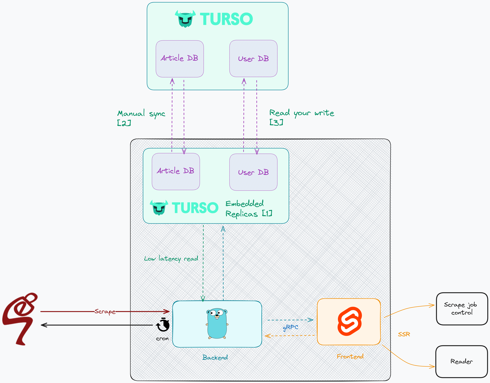

# RE:SEP
An alternative article reader for the [Stanford Encyclopedia of
Philosophy](https://plato.stanford.edu). Heavily inspired by
[Foliate](https://johnfactotum.github.io/foliate/).

## Planning (Drafted)
Please note that these are still subjected to changes during this phase. What you see may not
be in the final product.

This act more like a public notebook for me to draft out my thoughts, so you
should see things moving if I encounter any problem or find something new that
can improve the project.

### Architecture

Refer to Turso doc for the following:
- [1]: [Embedded Replicas](https://docs.turso.tech/features/embedded-replicas/introduction)
- [2]: [Manual Sync](https://docs.turso.tech/sdk/go/reference#manual-sync)
- [3]: [Read Your Write](https://docs.turso.tech/sdk/go/reference#read-your-writes)

### Pipeline

Notes:
- [1]: The current plan is to do user config styling based on pre-defined
values. Those value will be represented in styles using custom Tailwind classes.
The Golang backend will use goquery to add those classes to the html text before
sending out
- [2]: For user config changes from front-end, beside updating user config to
the database, the style changes will be hot-applied to current page using
client-side javascript. This is an attempt to both reduce server load and
improve UX. I call this process **Layering**, inspired by the
[similar functionality](https://docs.fedoraproject.org/en-US/fedora-silverblue/getting-started/#package-layering)
of Fedora Silverblue.

### Status: The Death of The Portfolio
Now that the backend is finally being worked on, the changes will no longer
be visible to the end user, and thus the image is broken.
